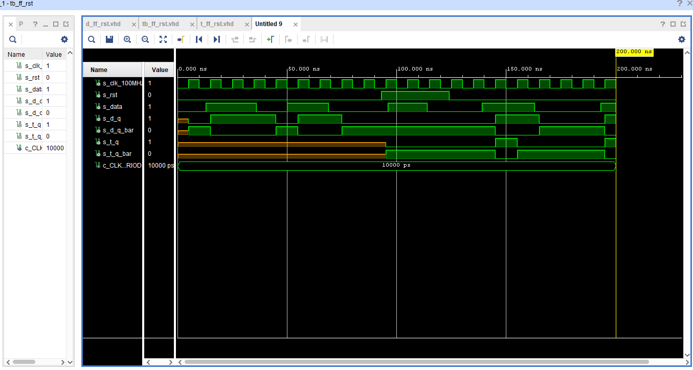
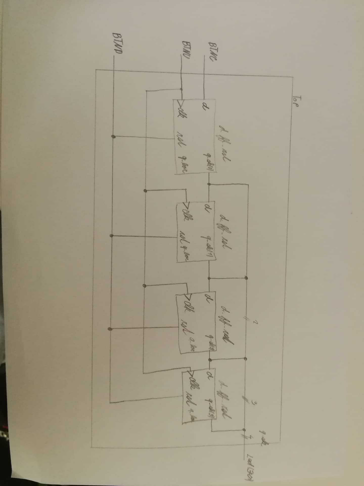

<<<<<<< HEAD
=======

>>>>>>> f4411104f6bd3bc75a8b68b6e2c450b20c939cd5
# Lab 5: YOUR_FIRSTNAME LASTNAME

### Flip-flops

1. Listing of VHDL architecture for T-type flip-flop. Always use syntax highlighting, meaningful comments, and follow VHDL guidelines:

```vhdl
architecture Behavioral of t_ff_rst is
<<<<<<< HEAD
    signal s_q : std_logic;
begin
    --------------------------------------------------------
    -- p_t_ff_rst:
    -- T type flip-flop with a high-active sync reset,
    -- rising-edge clk.
    -- q(n+1) = t./q(n) + /t.q(n)
    --------------------------------------------------------
    p_t_ff_rst : process(clk)
    begin

     if rising_edge(clk) then
    
    if(rst ='1') then
    
        s_q  <= '0';
        elsif (t='0') then
        s_q <= s_q;
        
        else 
        s_q<= not s_q;

         end if;
      end if;
    end process p_t_ff_rst;
    q       <=s_q;
    q_bar   <= not s_q;
=======
    signal s_q : std_logic;       -- Signal defined for previous state(need for T FF)
begin
 
    p_t_ff_rst : process(clk)
    begin
        if rising_edge(clk) then  -- Synchronous binary_read
            if (rst = '1') then
                s_q   <= '0';
            elsif (t = '0') then
                s_q   <= s_q;
            else                  -- t = '1'
                s_q   <= not s_q;
            end if;
        end if;
    end process p_t_ff_rst;
    
    q     <= s_q;                 -- Signal assigned to q
    q_bar <= not s_q;             -- Not of ignal assigned to q
>>>>>>> f4411104f6bd3bc75a8b68b6e2c450b20c939cd5
end architecture Behavioral;
```

2. Screenshot with simulated time waveforms. Try to simulate both flip-flops in a single testbench with a maximum duration of 200 ns, including reset. Always display all inputs and outputs (display the inputs at the top of the image, the outputs below them) at the appropriate time scale!

<<<<<<< HEAD
   
=======
   
>>>>>>> f4411104f6bd3bc75a8b68b6e2c450b20c939cd5

### Shift register

1. Image of the shift register `top` level schematic. The image can be drawn on a computer or by hand. Always name all inputs, outputs, components and internal signals!

<<<<<<< HEAD
   
=======
   
>>>>>>> f4411104f6bd3bc75a8b68b6e2c450b20c939cd5
